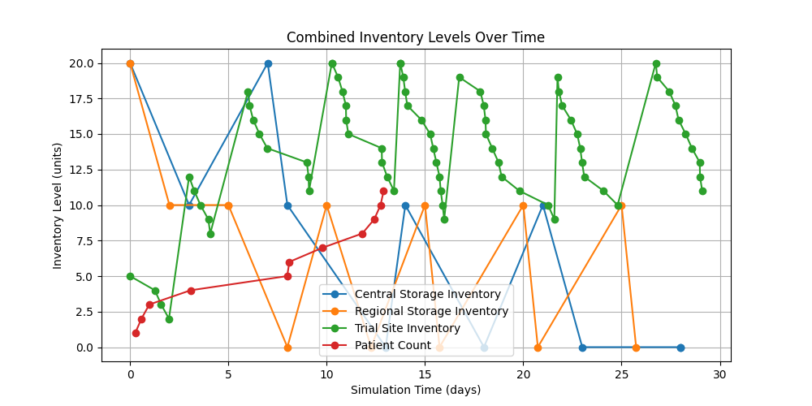
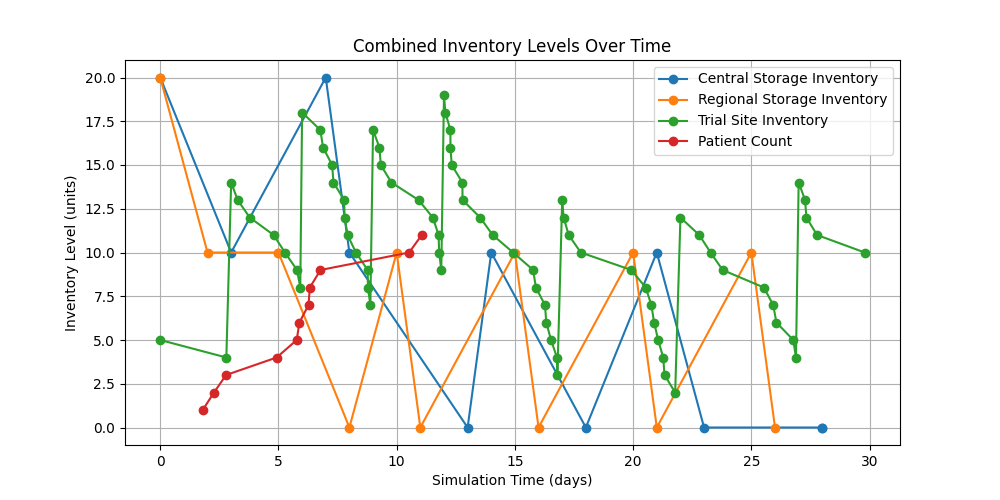
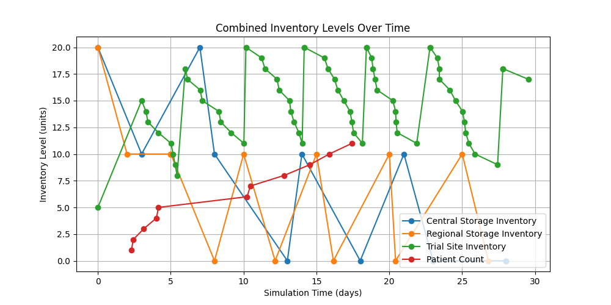

# Clinical Trial Supply Chain Simulation

## Overview

This project simulates the supply chain for a clinical trial, capturing key processes such as patient enrollment, demand forecasting, inventory management, drug manufacturing, storage, and distribution. The simulation is designed to help trial coordinators plan and optimize the supply chain to ensure that trial sites are adequately stocked with the investigational medicinal product (IMP) without incurring excessive costs due to overstocking or rushed shipments. The development of this project was enhanced by the use of advanced AI tools, enabling a more efficient and comprehensive simulation model.

## Simulation Modules

The simulation consists of several modules, each representing a critical component of the supply chain:

- **PatientEnrollment:** Simulates patient recruitment and dropout rates.
- **InventoryControl:** Manages stock levels and triggers reorders based on set thresholds.
- **ManufacturingFacility:** Produces the IMP according to a predetermined schedule and capacity.
- **CentralStorage:** Receives bulk shipments from the manufacturer and supplies the regional storage facilities.
- **RegionalStorage:** Holds a smaller stock of the IMP closer to trial sites for more agile distribution.
- **DosageAdministration:** Tracks patient dosages and forecasts demand at the site level.
- **DistributionNetwork:** Manages the transport of the IMP between manufacturing, storage, and trial sites.

## Running the Simulation

### Prerequisites
- Python 3.6 or higher
- SimPy
- Other dependencies as listed in `requirements.txt`

### Instructions
1. Clone the repository to your local machine.
2. Install dependencies using `pip install -r requirements.txt`.
3. Modify the configuration file `data.yaml` as needed for different trial scenarios.
4. Run the simulation script with `python simulation.py`.

## Analyzing Results

The simulation will output logs that show the day-to-day operations of the trial's supply chain, including patient enrollment, drug production, inventory levels, and distribution events. Analyze these logs to assess the performance of the supply chain and make data-driven decisions to optimize operations.
To add screenshots to your README in a tactful and informative way, you can include them under a dedicated section such as "Sample Outputs" or "Simulation Visualizations". This section can be placed after the "Analyzing Results" section. Here's how you might structure it:

---

## Simulation Visualizations

To provide a clear understanding of the simulation's output and capabilities, below are screenshots from three simulation runs. These visualizations depict the combined inventory levels over time for trial sites, regional storage, and central storage, showcasing the dynamics of the supply chain in different scenarios.

### Simulation Run 1

### Simulation Run 2

### Simulation Run 3

